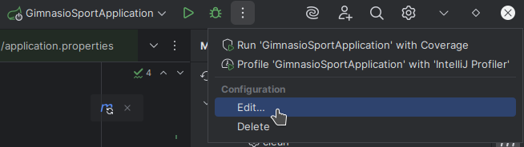
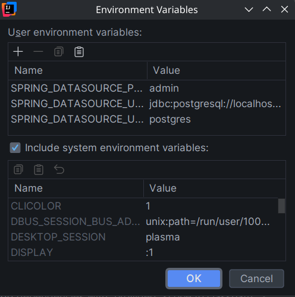

# Gimnasio Sport

Proyecto del Práctico Integrador I de Ingeniería de Software II.

## Preparación del entorno

Para que la app funcione, debe estar configurada correctamente la conexión a la base de datos. Para ello, debe estar ejecutándose PostgreSQL o MySQL, y debe estar creada una base de datos (del nombre que queramos).

Luego hay que configurar las credenciales de la base de datos. Esto se hace a través de las siguientes variables de entorno. Hay que setearlas en el IDE, o en la terminal, dependiendo de desde dónde queramos ejecutar la app.

```
SPRING_DATASOURCE_URL=jdbc:postgresql://localhost:5432/nombredb
SPRING_DATASOURCE_USERNAME=usuario
SPRING_DATASOURCE_PASSWORD=contraseña
```

Por defecto el proyecto utiliza PostgreSQL, si queremos usar MySQL, hay que colocar el url adecuado, y además configurar la siguiente variable de entorno.

```
SPRING_DATASOURCE_DRIVER_CLASS_NAME=com.mysql.cj.jdbc.Driver
```


### a) Ejemplo en IntelliJ

1) Editar la configuración de ejecución.

    

2) Setear las variables de entorno mencionadas. La sección de "Variables de entorno" puede que esté oculta, pero se puede añadir desde ese mismo menú o con <kbd>Alt</kbd>+<kbd>E</kbd>.

    


### b) Ejemplo en la terminal

1) Setear las variables de entorno (solo hace falta una vez hasta que se cierre la terminal).

    ```bash
    export SPRING_DATASOURCE_URL=jdbc:postgresql://localhost:5432/nombredb \
    export SPRING_DATASOURCE_USERNAME=usuario \
    export SPRING_DATASOURCE_PASSWORD=contraseña
    ```

3) Ejecutar el siguiente comando dentro del directorio `backend/` para compilar y ejecutar la app.

    ```bash
    ./mvnw spring-boot:run
    ```


## Empaquetado

Si queremos empaquetar la app en un .jar, solo hay que ejecutar el siguiente comando dentro del directorio `backend/`:

```bash
./mvnw package
```

El .jar se creará en el directorio `target/`. Se puede ejecutar con `java -jar target/nombre_del_archivo.jar`. Para que se ejecute correctamente, hay que setear las variables de entorno ya mencionadas (en este caso, en la terminal).